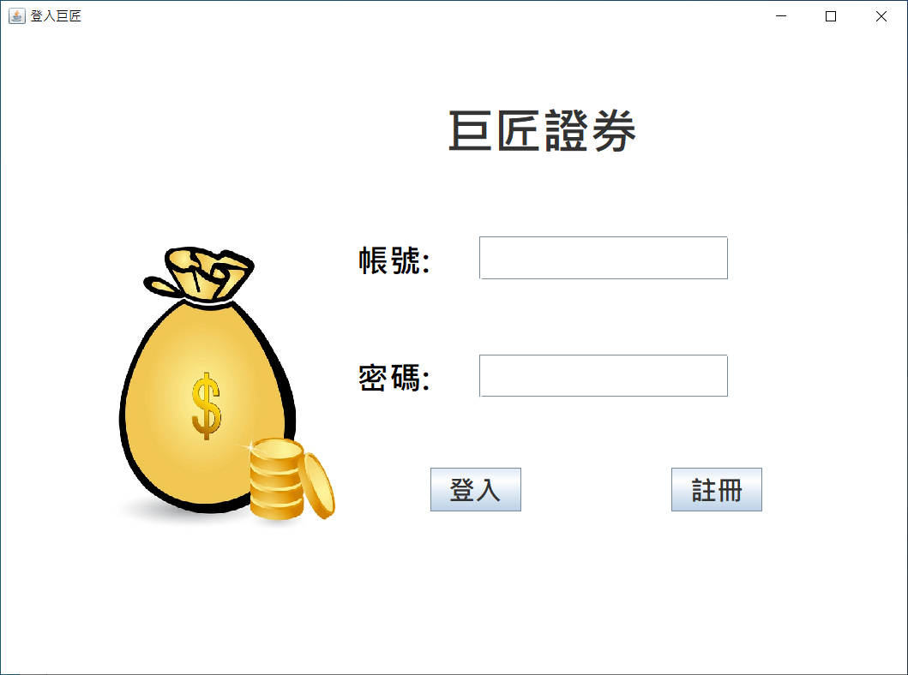
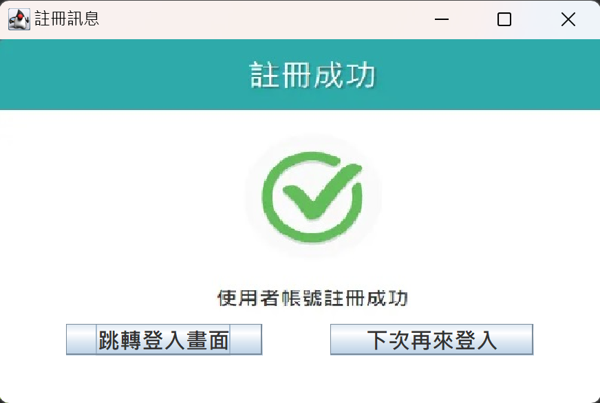
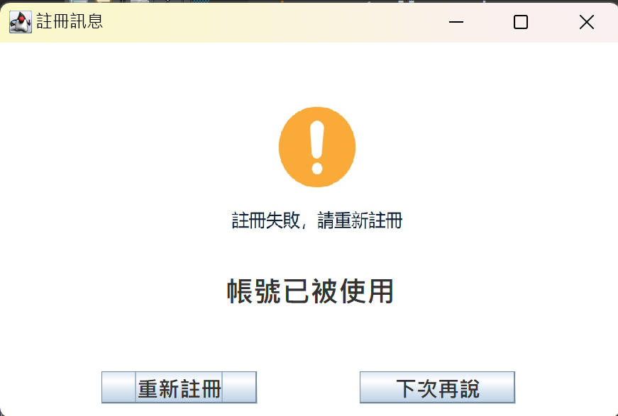
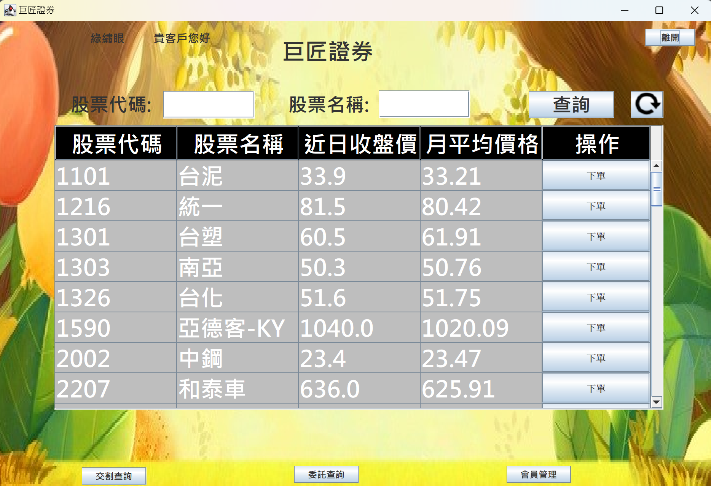
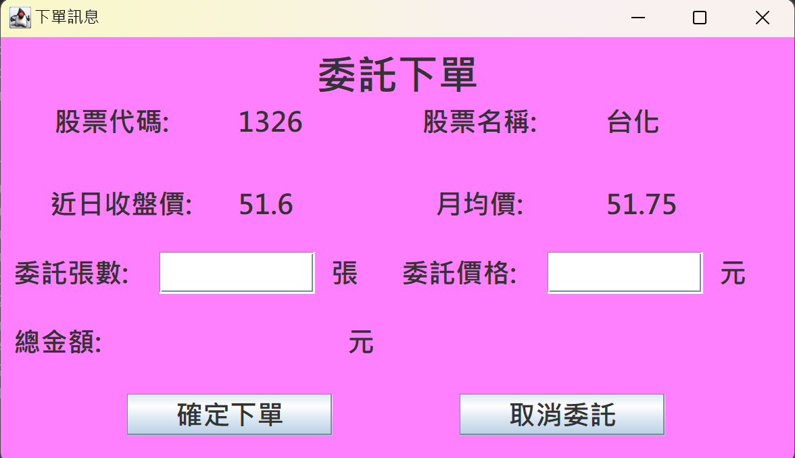
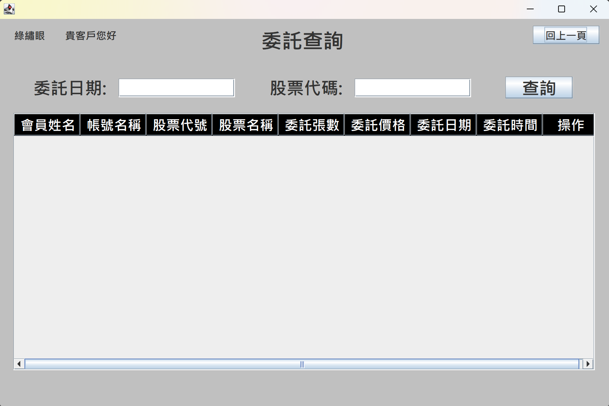
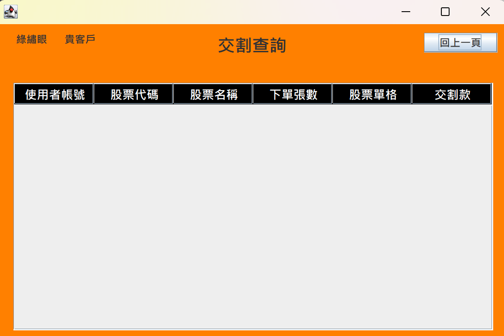
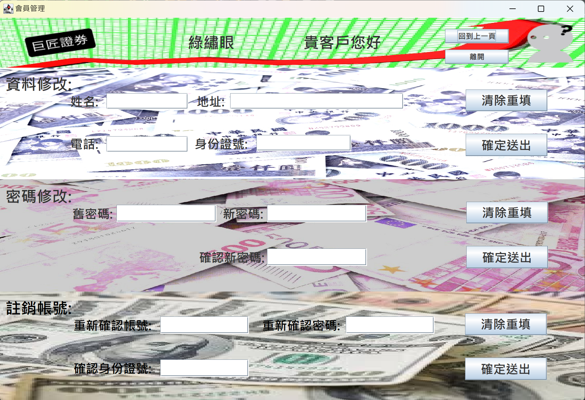

# 模擬股票交易
本系統為java雲端企業班的第四次作業 
經由簡單的操作，進行股票的委託與取消 
當前版本:v1.0 
頁面說明: 
### 登入頁面頁面說明 
填寫帳號密碼，若是還沒有註冊帳號，請點選註冊按鈕，進行註冊 
若已有帳號密碼，請直接登入
 
### 註冊會員頁面說明 
註冊規則: 
1.帳號:包含小寫英文及數字 2.密碼:包含大小寫英文、數字、特殊符號 3.身分證號:符合中華民國規則 
 
註冊成功後，跳轉回登入畫面，或是離開系統 
 
註冊失敗，重新跳轉回註冊畫面，或是離開系統 
 
登入成功後，跳轉下單畫面 
### 股票頁面說明 
操作說明: 
股票代碼及名稱可擇一輸入(股票資料不足，僅能查詢台灣50的成分股)，並點選查詢按鈕查詢資料 
重新整理按鈕，讓欄位回復到查詢前的畫面 
點選離開按鈕，關閉系統 
 
#### 說明股票頁面中的按鈕功能說明 
點選下單按鈕，跳轉下單畫面 
填寫委託張數(1張=1000股)及委託價格(可以參考收盤價及近日收盤價)，並於下方顯示總金額 
按下確定下單，完成委託，或是取消委託，回到股票頁面 
 
輸入委託日期(輸入格式，例如:2024-07-07)或是股票代碼即可查詢帳戶的委託資訊 
查詢後可以點擊刪除，刪掉委託 
 
查詢帳戶內的委託交易 
 
### 會員管理頁面說明 
#### 資料修改 
不需要全部填滿，只需要填寫需要更改的格子，在點擊確定送出修改資料 
填錯可以點擊清除重填，清空格子 
#### 密碼修改 
輸入完成後，舊密碼正確的話，可以修改密碼的資料，並會跳轉回登入畫面 
填錯可以點擊清除重填，清空格子 
#### 註銷帳號 
輸入完成後，密碼身分證號正確的話，就能註銷帳號，並會跳轉回登入畫面 
填錯可以點擊清除重填，清空格子 
 

